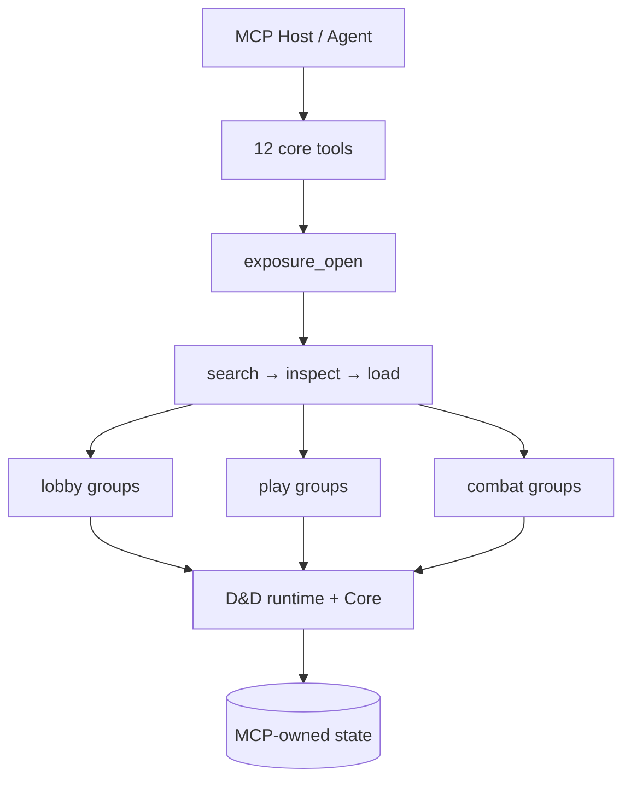

# SagaSmith D&D MCP

[平台总览](https://github.com/SagaSmithAI/.github/blob/main/profile/README.md) · [D&D runtime](https://github.com/SagaSmithAI/Sagasmith-dnd) · [D&D Skills](https://github.com/SagaSmithAI/SagaSmith-dnd-skills)

**SagaSmithAI 的 D&D 5e Agent 能力服务。** 它通过标准 stdio MCP 将 SagaSmith Core、D&D 规则运行时、D&D Skills 和模组生成 Skill 组合成一个可被不同 Agent Host 复用的服务端边界。

与“把 70+ 个工具一次性塞给模型”不同，本服务在 MCP 侧维护会话级 exposure：先发现能力组，再按当前 `lobby` / `play` / `combat` 阶段加载少量工具，并在阶段、权限或 TTL 改变时收回。

## 为什么 exposure 在 MCP 侧

- **跨 Host 一致** — NanoBot、Codex 或任何兼容 MCP client 使用同一套目录、权限与阶段规则。
- **会话隔离** — exposure 绑定 MCP session、认证 principal 和 campaign；同一服务上的两个会话可以加载不同工具组。
- **阶段安全** — 权威阶段来自 campaign state。开战后 lobby/play 写工具不会继续残留，结束战斗后 combat 工具被收回。
- **最小暴露** — 首次 `tools/list` 只有 12 个核心发现/诊断工具，而不是整个领域 schema。
- **服务端执行门禁** — 未暴露工具即使通过 `exposure_call` 指定名称也会被拒绝；权限不是提示词约定。

## 运行结构



默认状态目录：

```text
<workspace>/.sagasmith-dnd-mcp/
  data/ttrpgbase.db       # campaign, rules, FTS, branches, knowledge
  data/chroma_db/         # optional dense retrieval
  artifacts/modules/      # editable generated modules before import
  artifacts/rulebooks/    # content-addressed staged user books
```

客户端不应直接写 SQLite、ChromaDB 或 artifact 目录。所有写入通过 MCP，确保迁移、revision、幂等、权限与 audit receipt 使用同一过程边界。

## 安装与启动

Python 3.11+：

```powershell
pip install -e ".[dev]"
sagasmith-dnd-mcp
```

若要连接 D&D Workbench UI，同时安装并启动 HTTP/SSE adapter：

```powershell
pip install -e ".[gateway,dev]"
sagasmith-dnd-gateway
```

Gateway 默认只监听 `127.0.0.1:8766`。读请求按 `X-SagaSmith-Principal` 投影；战斗移动写请求不会直写数据库，而是调用同一服务实现中的 `combat_movement` MCP 工具，因此仍经过 actor 权限、campaign/branch revision、幂等、五尺格、阻挡与反应窗口校验。SSE 只发布 revision 变化通知，客户端随后重新读取 audience-filtered DTO。

启用向量嵌入：

```powershell
pip install -e ".[dense,dev]"
$env:SAGASMITH_DND_MCP_DENSE_ENABLED = "1"
sagasmith-dnd-mcp
```

## Agent 配置

NanoBot 示例；其他 stdio MCP Host 使用相同的 `command`、`cwd` 与 `env`：

```json
{
  "tools": {
    "mcpServers": {
      "sagasmith_dnd": {
        "command": "C:\\path\\to\\SagaSmith-dnd-mcp\\.venv\\Scripts\\sagasmith-dnd-mcp.exe",
        "args": [],
        "cwd": "C:\\path\\to\\SagaSmith-dnd-mcp",
        "env": {
          "SAGASMITH_DND_MCP_HOME": "C:\\path\\to\\workspace\\.sagasmith-dnd-mcp"
        },
        "toolTimeout": 60,
        "injectPrincipal": true,
        "enabledTools": [
          "exposure_open",
          "exposure_status",
          "exposure_search",
          "exposure_inspect",
          "exposure_load",
          "exposure_unload",
          "exposure_call",
          "server_capabilities",
          "server_tool_profiles",
          "storage_status",
          "campaign_query",
          "game_phase"
        ]
      }
    }
  }
}
```

`injectPrincipal` 应在多人渠道中开启。Host 注入的 principal 是认证身份，模型不能自行声明；grant 工具中的目标 principal 与调用者身份是两个字段。

## 渐进式调用流程

```text
1. exposure_open(campaign_id?, principal_id injected)
2. exposure_search("create a 2024 character")
3. exposure_inspect("lobby.characters")
4. exposure_load(["lobby.characters"])
5. 重新 tools/list，原生调用新出现的工具
6. exposure_unload(...) 或等待阶段/TTL 自动收回
```

支持动态工具列表的 Host 使用原生 `tools/list` + `tools/call`；不能刷新 schema 的 Host 可使用 `exposure_call` fallback。两条路径都经过同一个服务端 exposure 与权限检查。

## 能力组

| 阶段 | 组 | 用途 |
|---|---|---|
| lobby | `bootstrap`, `campaign`, `characters` | 建团、成员/分支/Snapshot、车卡和初始资源 |
| lobby | `rules`, `modules`, `memory` | 规则书/规则包、模组、长期记忆与 actor knowledge |
| lobby | `storage_admin` | 本地 schema 管理；只允许显式 local admin |
| play | `scene`, `characters`, `resolution` | 场景推进、非战斗状态、检定与开战 |
| combat | `observe`, `turn`, `actions` | 可见战斗状态、回合、攻击/法术/反应/移动 |
| combat | `save`, `map` | 战斗中分支 Snapshot 与临时地图更新 |

每个组声明 risk、角色要求、是否需要 campaign、是否仅限本地。`server_tool_profiles` 返回机器可读目录，客户端不需要复制这张表。

## D&D 能力面

### 战役、分支与知识

服务提供 campaign/membership、角色控制、事件、Snapshot DAG、branch checkout、continuity context、修订式记忆以及 PC/NPC 独立的 actor knowledge。玩家只能读取当前分支、允许的场景 scope、自己控制角色的完整 sheet，以及角色真正知道的事实。

Snapshot 是可独立恢复的全量 checkpoint，`recap` 才是父子节点差量。切换 branch 前当前工作区必须已经保存；否则服务拒绝 checkout，避免角色状态与 actor knowledge 落在不同时间点。

### 规则与扩展书

用户规则书的完整路径是：

```text
allowlisted file
→ staged content-addressed artifact
→ shared document parse + quality report
→ indexed source
→ inactive draft rule pack
→ schema/mechanic validation
→ install
→ DM pins exact version to campaign
```

导入文本本身不会自动变成可执行规则。只有通过 mechanic IR 和 provider 校验的部分参与结算。2014/2024 核心引擎也封装为不可变内置 core pack；campaign 和 Snapshot 锁定精确版本、checksum 与依赖，恢复时缺少任何包都会拒绝物化状态。

规则 profile/pack 写入要求最新 `expected_revision` 和稳定 `idempotency_key`。`campaign_rules_explain` 给出当前 branch lock、fingerprint、mechanic ids 与引用；rule receipt 保留结算时使用的不可变证据。

### 模组与战斗空间

模组生成先形成可编辑 artifact，再经 staged inspect/import。导入生成 scene index 和保守的 location/room 证据；系统不会从散文中凭空画精确战术地图。战斗开始时才为 encounter 创建临时五尺方格 combat map，随后由 DM/Agent 在证据和裁决基础上补充位置与世界变化。地图背景不具机械意义；墙体、视线、掩体、高度、体型占位和困难地形消耗在引擎实现前继续由 DM 裁决。

### Skills、resources 与 prompts

- Skill 文档资源：`sagasmith://skill/{skill_id}`
- 静态目录：`sagasmith://skills/overview`
- 动态引用/数据/模板：`skill_asset_list` 与 `skill_asset_read`
- Prompts：`dnd_dm`、`module_generator`

部分 Host 只发现静态 resources，不发现 resource templates；这时通过 asset 工具读取动态资源。

## 配置

| 环境变量 | 作用 |
|---|---|
| `SAGASMITH_DND_MCP_HOME` | 移动服务拥有的全部本地状态 |
| `SAGASMITH_DND_MCP_DENSE_ENABLED=1` | 启用 embedding-backed retrieval |
| `SAGASMITH_DATABASE_URL` | 使用外部 Core 数据库 |
| `CHROMA_DB_URL` / `CHROMA_DB_PATH` | 远程或自定义本地 Chroma |
| `SAGASMITH_DND_SKILLS_DIR` | 指向 D&D Skills checkout |
| `SAGASMITH_MODULEGEN_SKILLS_DIR` | 指向 module generator checkout |
| `SAGASMITH_DND_MCP_RULE_IMPORT_ROOTS` | `os.pathsep` 分隔的规则书导入白名单 |
| `SAGASMITH_DND_MCP_MODULE_IMPORT_ROOTS` | `os.pathsep` 分隔的模组 PDF/Markdown/text 导入白名单 |
| `SAGASMITH_DND_MCP_AUTO_SEED=0` | 禁用 bundled core reference 自动 seed |
| `SAGASMITH_DND_GATEWAY_HOST` / `PORT` | UI adapter 监听地址，默认 `127.0.0.1:8766` |
| `SAGASMITH_DND_GATEWAY_TOKEN` | 非 loopback 访问所需 Bearer token |
| `SAGASMITH_DND_GATEWAY_ORIGINS` | 逗号分隔的精确 CORS origin allowlist |

服务永远不会直接导入模型任意选择的路径。规则书必须位于 allowlisted root；商业内容由用户自行确保使用权。

## 验证

```powershell
pytest
ruff check .

# 使用全新 home 的真实 smoke 数据；不会迁移旧数据
$env:PYTHONPATH = "$PWD\src;$PWD\..\sagasmith-core\src;$PWD\..\sagasmith-dnd\src"
python scripts\smoke_seed.py --home C:\tmp\sagasmith-dnd-smoke-01
```

Smoke seed 创建两个 PC、一个 NPC、相互隔离的 actor knowledge、一个见证事件、受审计的钱包变更和基线 Snapshot。

## 状态与许可

项目处于 Alpha，但这是 SagaSmithAI 当前最完整的 Agent-to-rules 参考实现。代码使用 MIT License；用户导入内容保留各自许可与来源。
